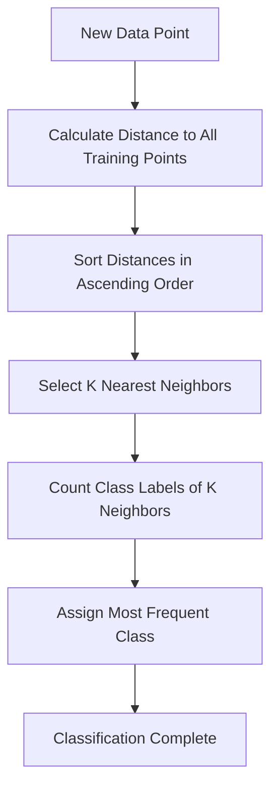

# K-Nearest Neighbors (KNN) Algorithm 📊


---

## 🎯 What is KNN?

**K-Nearest Neighbors (KNN)** is a **supervised learning algorithm** that classifies data points based on the class of their nearest neighbors in the feature space. It's often called a "lazy learning" algorithm because it doesn't build an explicit model during training.

### 🐱🐶 Simple Example: Cat vs Dog Classification

Imagine you have a dataset of animals with features like:
- **Weight**: 5kg, 15kg, 25kg
- **Height**: 30cm, 45cm, 60cm

When a new animal arrives with weight=12kg and height=40cm, KNN will:
1. Find the K nearest animals in the dataset
2. Look at their labels (Cat/Dog)
3. Classify the new animal based on the majority vote

If K=3 and the 3 nearest neighbors are: Dog, Dog, Cat → **Result: Dog** 🐕

---

## 🔢 Choosing the Right K Value

The choice of **K** significantly impacts the algorithm's performance. Let's see how different K values affect classification:

### Example Scenario
**Unknown Data Point**: Weight=57kg, Height=170cm

| K Value | Nearest Neighbors | Classification Result |
|---------|-------------------|----------------------|
| **K=3** | 3 closest points | Based on majority of 3 neighbors |
| **K=7** | 7 closest points | Based on majority of 7 neighbors |

### 📈 K=3 vs K=7 Impact

- **K=3**: More sensitive to local patterns, might be affected by noise
- **K=7**: More stable, considers broader neighborhood, smoother decision boundary

> **Rule of Thumb for Choosing K**: 
> - Small K → More complex decision boundary (high variance, low bias)
> - Large K → Smoother decision boundary (low variance, high bias)
> - **Optimal K = √n** (where n is the number of training samples)

### 🔢 K Selection Formula

**K = √n** is a widely used heuristic:

| Dataset Size (n) | Recommended K (√n) | Rounded K |
|------------------|-------------------|-----------|
| 25 samples | √25 = 5 | **K = 5** |
| 100 samples | √100 = 10 | **K = 10** |
| 400 samples | √400 = 20 | **K = 20** |
| 1000 samples | √1000 ≈ 31.6 | **K = 31** |

> **Pro Tip**: Always choose an **odd number** for K to avoid ties in binary classification!

---

## 📋 When to Use KNN?

KNN works best when your data has these characteristics:

| ✅ **Use KNN When** | ❌ **Avoid KNN When** |
|---------------------|----------------------|
| Data is **labeled** | Unlabeled data |
| Dataset is **noise-free** | High noise levels |
| **Small to medium** dataset | Very large datasets |
| Features are **normalized** | Features have different scales |
| Need **interpretable** results | Need fast predictions |

### 📊 Example Dataset Structure
```
| Feature1 | Feature2 | Feature3 | Label    |
|----------|----------|----------|----------|
| 5.1      | 3.5      | 1.4      | Setosa   |
| 4.9      | 3.0      | 1.4      | Setosa   |
| 7.0      | 3.2      | 4.7      | Virginica|
| 6.4      | 3.2      | 4.5      | Virginica|
```

---

## ⚙️ How KNN Works: Step-by-Step

Based on the provided example, let's understand how KNN classifies a person as "Normal" or "Underweight":

### 🎯 **Problem**: Classify a person with Weight=57kg, Height=170cm

### **Step 1: Calculate Euclidean Distance**
For each training point, calculate distance to unknown point (57, 170):

```
Distance = √[(x₂-x₁)² + (y₂-y₁)²]
```

| Weight | Height | Class | Distance from (57,170) |
|--------|--------|-------|------------------------|
| 51 | 167 | Underweight | 6.7 |
| 62 | 182 | Normal | 13.0 |
| 69 | 176 | Normal | 13.4 |
| 64 | 173 | Normal | 7.6 |
| 65 | 172 | Normal | 8.2 |
| 56 | 174 | Underweight | 4.1 |
| 58 | 169 | Normal | **1.4** |
| 57 | 173 | Normal | **3.0** |
| 55 | 170 | Normal | **2.0** |

### **Step 2: Select K Nearest Neighbors**
For **K=3**, the nearest neighbors are:
- (58, 169) - Normal - Distance: 1.4
- (55, 170) - Normal - Distance: 2.0  
- (57, 173) - Normal - Distance: 3.0

### **Step 3: Make Prediction**
**Majority Vote**: 3 Normal, 0 Underweight
**Final Classification**: **Normal** ✅

---

## 🧮 Distance Calculation Example

```python
import math

# Unknown point
x1, y1 = 57, 170

# Training points
points = [(58, 169), (55, 170), (57, 173)]

# Calculate distances
for i, (x2, y2) in enumerate(points):
    distance = math.sqrt((x2-x1)**2 + (y2-y1)**2)
    print(f"Point {i+1}: Distance = {distance:.1f}")

# Output:
# Point 1: Distance = 1.4
# Point 2: Distance = 2.0  
# Point 3: Distance = 3.0
```

---

## 📊 Algorithm Flowchart



---

## 🎨 Advantages & Disadvantages

### ✅ **Advantages**
- Simple to understand and implement
- No assumptions about data distribution
- Works well with small datasets
- Can be used for both classification and regression
- Naturally handles multi-class problems

### ❌ **Disadvantages**
- Computationally expensive for large datasets
- Sensitive to irrelevant features
- Requires feature scaling
- Memory intensive (stores entire training set)
- Sensitive to local structure of data

---

## 🚀 Quick Implementation Tips

1. **Normalize your features** using Min-Max scaling or Z-score normalization
2. **Choose odd K values** to avoid ties in classification
3. **Use cross-validation** to find optimal K
4. **Consider distance metrics** (Euclidean, Manhattan, Minkowski)
5. **Handle categorical features** appropriately

---

## 📚 Key Takeaways

- KNN is a **lazy learning** algorithm that makes predictions based on similarity
- The choice of **K** is crucial and affects the bias-variance tradeoff
- Works best with **clean, labeled, and normalized** data
- **Distance calculation** is the heart of the algorithm
- Perfect for **small to medium datasets** where interpretability matters

---

*Happy Learning! 🎓*

> **Note**: This README provides a comprehensive overview of KNN algorithm with practical examples. For implementation details, refer to scikit-learn documentation or implement from scratch using the concepts explained above.